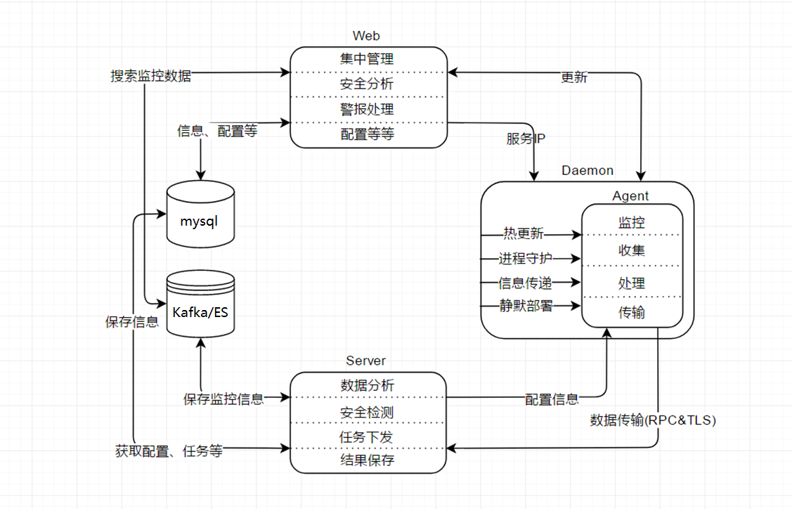

# Code-young HIDS 
----------
**CY HIDS**是一款由 `Agent`，`Collect`和`Analysis`三大部分组成，集异常检测、监控管理为一体，拥有异常行为发现、快速阻断、高级分析等功能，可从多个维度行为信息中发现入侵行为。

**Agent**为采集者角色，收集服务器信息、开机启动项、计划任务、监听端口、服务、登录日志、用户列表，实时监控文件操作行为、网络连接、执行命令，初步筛选整理后通过RPC协议传输到Server(Flume)节点。

**Collect**为系统的中间物理节点，定期同步Analysis下发给agent的指令及更新信息供Agent取用。

**Analysis**为整套系统的大脑，支持Agent宿主机信息查询，Agent模块梯度热更新，分组，任务关联，告警提示，对从各Agent接收到的信息和行为进行分析检测和保存，可从各个维度的信息中发现异常登录行为、异常网络连接行为、异常命令调用行为等，从而实现对入侵行为实时预警。


## 文档（持续更新）

* [部署文档](./docs/)
* [使用帮助](./docs/)
* [规则编写](./docs/)
* [编译指南](./docs/)

## 功能特点（持续完善）


- 实时监控、秒级响应
- 静默部署、信息收集
- 横向对比、未知预警（文件&网络连接）
- 高级分析、威胁溯源（网络->进程行为）
- 全局响应、快速阻断（进程、文件、网络）


> 相比其他同类应用，维护使用此系统需要有一定的安全判断分析能力
> 一期确保Agent稳定运行及信息收集
>二期实现Server端分析、Agent关联溯源及响应阻断

## 整体架构图



## TODO
- 配置精细化
- 基线核查
- 网络连接
- Rootkit检查
- 文件操作行为
- 进程执行过程（系统调用、打开的文件、建立的Socket）
- Linux使用者执行命令
- Agent与Server通信的单双向验证（SSL）
- 幻影蜜罐（基于真实环境虚化出来的动态蜜罐，无需独立部署）
- 支持多场景（运维、研发、办公、线上环境、Docker）
- 机器学习判断可疑行为（减少人为筛选过程）


## 进程结构
```
├─agent 
│  ├─guard//守护进程
│  ├─main //指令接受、状态反馈、模块更新
│  ├─filecheck //信息收集（文件监控、特性信息上报）
│  ├─syscheck //信息收集（软件信息、进程信息、用户信息、组信息、自启动信息、服务信息、端口信息、防火墙信息、内核模块信息、配置文件信息）
│  └─logforward  //日志转发（RPC、队列缓存、离线Sqlite3缓存）
│  
├─collect 
│  ├─guard //守护进程
│  └─main //转发Agent通知、同步Analysis指令、统计Agent状态，上报Agent心跳
│
├─analysis
│  ├─guard //守护进程
│  └─main //控制Agent更新、分析Agent状态、统计Agent日志
│
├─consumer//消费Kafka-topic更新本地静态日志库
│
└─end
```

## 源码结构
```
├─public // 公共模块
│  ├─network //TLS传输
│  ├─storage //Mysql封装
│  └─task //核心任务注册调度
│
├─agent // Agent工程
│  ├─dlfunc //检测信息收集
│  ├─logstash //RPC 日志缓存转发
│  ├─report //Agent通知上报
│  ├─storage //Sqlite3本地信息缓存
│  └─task //Agent 核心任务注册及消息处理
│
├─collect // Collect工程
│  ├─collect//核心任务注册及消息处理
│  └─put_cgi //Agent 请求Reply处理
│
├─analysis // Analysis工程
│  ├─analysis//核心任务注册及消息处理
│  ├─security-env//安全运行环境
│  ├─consumer//Libkafka消费日志
│  └─put_cgi //Collector 请求Reply处理
│
├─web  // web工程
│  ├─Home // Agent集群、告警等概要信息
│  │ 
│  ├─主机管理 
│  │  ├─主机状态 //宿主机基本信息及Agent存活摘要
│  │  ├─主机分组 //宿主机Agent分组
│  │  └─主机日志  //Agent任务执行次数统计
│  │ 
│  ├─Collector管理
│  │  ├─Collector状态 //宿主机基本信息及Collector存活摘要
│  │  └─Collector主机集 //单Collector挂载Agent集群状态
│  │ 
│  ├─任务模板
│  │  ├─功能模板 //配置基本任务
│  │  └─任务关联 //生成任务组，关联Agent组
│  │ 
│  ├─日志管理
│  │  ├─主机日志 //主机模块更新、任务进程启停、宿主机负载信息
│  │  ├─登录日志 //系统用户登入登出日志
│  │  └─操作日志 //系统用户操作日志
│  │ 
│  ├─系统管理
│  │  ├─系统状态 //Analyser主机系统状态
│  │  ├─用户管理 //增加删除系统用户
│  │  └─版本更新 //Agent更新包更新、主版本更新、分组更新
│  │ 
│  └─end
│
└─end
```

## 参与者及致谢

参与者：杨学良（yangxueliangit@163.com）

参考：
OSSEC
OSquery
Netdata
Nicstat
Netstat
Kmod.lsmod 
Iptables
Sysvinit
Systemd
Iotop
Tiger


致谢列表：
